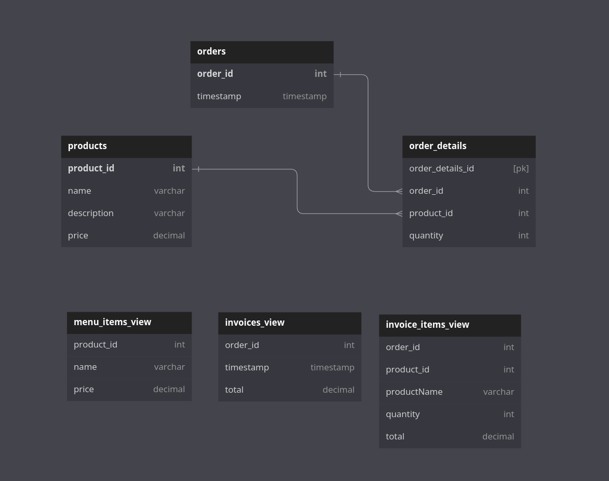
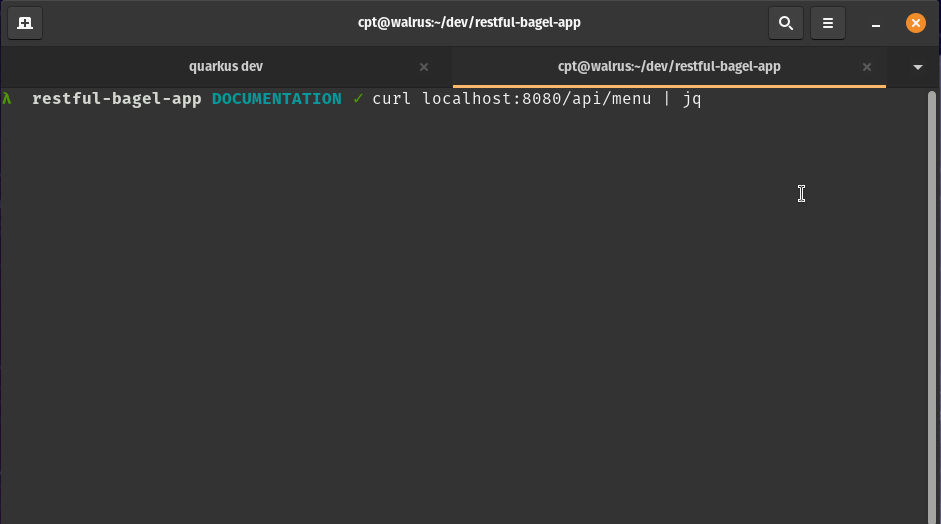
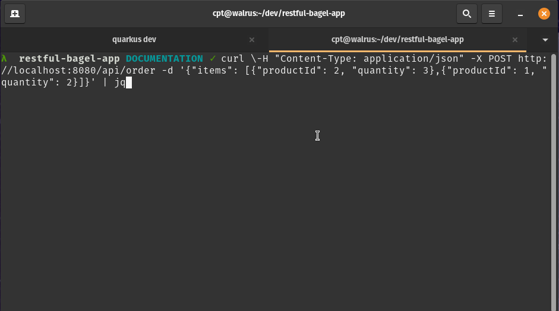
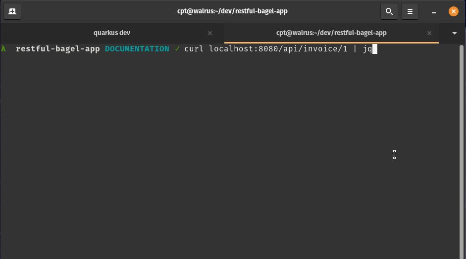

# Quarkus RESTful Bagel App

This is a project to put together all the knowledge I read from Understanding Quarkus. It was original going to be a small and simple RESTful API which only returned static data hile using an in memory List as a pseudo database. It slowly evolved into learning a few other frameworks at the same time.

Additional frameworks to learn:
- Flyway - Datbase migrations
- JOOQ - Java type safe SQL queries
- Immutables - Value objects code generation
- RESTassured - REST API test framework
- EqualsVerifier - Equals and hashCode test framework
- ArchUnit - Java architecture test framework

## Objective and Appraoch

When working on this project there was one goal: "Retrieve a list of bagels and make a simple sale, like a bagel shop". The approach to get there was to do the smallest and simplest goal first. After that is was like a painting. I kept adding little functionality on top of additional functionality with little commits every day.

When I felt that it was complete, it went from a project with just a couple of APIs and POJOs to an application with several new frameworks I have not worked with and backing database model.

## APIs

GET - /api/menu
- Retrieves a list of available products to order... probably all bagel related.

POST - /api/order
- Submits an order with products and quantity

GET - /api/invoice/{id}
- Retrieves a human readable overview of the order with totals for the entire order and per line item.

## Database Diagram

The diagram below shows the structure of the database tables.

There are three core tables for data which include product, orders, and order details. These tables content the data which represent the bagel shop. Products which can be used to order, and Orders which contains order information.

There are three views which prodide information for viewing and aggregatioin. Menu is a view to display which products are available. Invoices agregates order information into a human readiable format with totals and product names.



## Demostration

Demostration of menu api - `/api/menu`



Demostration of order api - `/api/order`



Demostration of invoice api - `/api/invoice`



## Running the application in dev mode

You can run your application in dev mode that enables live coding using:
```shell script
./mvnw compile quarkus:dev
```
